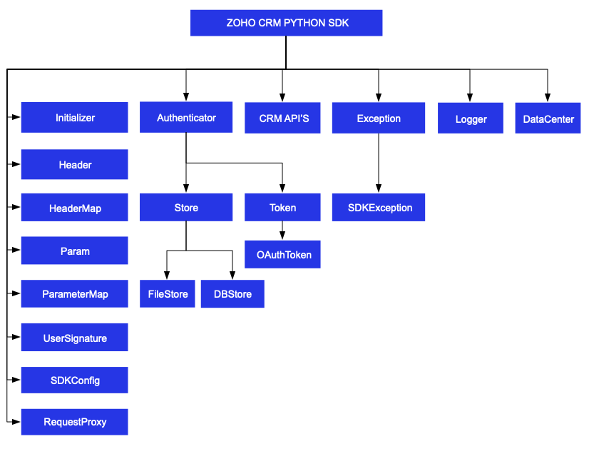

License
=======

    Copyright (c) 2021, ZOHO CORPORATION PRIVATE LIMITED 
    All rights reserved. 

    Licensed under the Apache License, Version 2.0 (the "License"); 
    you may not use this file except in compliance with the License. 
    You may obtain a copy of the License at 
    
        http://www.apache.org/licenses/LICENSE-2.0 
    
    Unless required by applicable law or agreed to in writing, software 
    distributed under the License is distributed on an "AS IS" BASIS, 
    WITHOUT WARRANTIES OR CONDITIONS OF ANY KIND, either express or implied. 
    See the License for the specific language governing permissions and 
    limitations under the License.

# ZOHO CRM PYTHON SDK 6.0 for API version 6

## Table Of Contents

* [Overview](#overview)
* [Registering a Zoho Client](#registering-a-zoho-client)
* [Environmental Setup](#environmental-setup)
* [Including the SDK in your project](#including-the-sdk-in-your-project)
* [Persistence](#token-persistence)
  * [DataBase Persistence](#database-persistence)
  * [File Persistence](#file-persistence)
  * [Custom Persistence](#custom-persistence)
* [Configuration](#configuration)
* [Initialization](#initializing-the-application)
* [Class Hierarchy](#class-hierarchy)
* [Responses And Exceptions](#responses-and-exceptions)
* [Threading](#threading-in-the-python-sdk)
  * [Multithreading in a Multi-User App](#multithreading-in-a-multi-user-app)
  * [Multi-threading in a Single User App](#multi-threading-in-a-single-user-app)
* [Sample Code](#sdk-sample-code)
## Overview

Zoho CRM PYTHON SDK offers a way to create client Python applications that can be integrated with Zoho CRM.

## Registering a Zoho Client

Since Zoho CRM APIs are authenticated with OAuth2 standards, you should register your client app with Zoho. To register your app:

- Visit this page [https://api-console.zoho.com](https://api-console.zoho.com)

- Click on `ADD CLIENT`.

- Choose the `Client Type`.

- Enter **Client Name**, **Client Domain** or **Homepage URL** and **Authorized Redirect URIs** then click `CREATE`.

- Your Client app will be created.

- Select the created OAuth client.

- Generate grant token by providing the necessary scopes, time duration (the duration for which the generated token is valid) and Scope Description.

## Environmental Setup

Python SDK is installable through **pip**. **pip** is a tool for dependency management in Python. SDK expects the following from the client app.

- Client app must have Python(version 3 and above)

- Python SDK must be installed into client app through **pip**.

## Including the SDK in your project

- Install **Python** from [python.org](https://www.python.org/downloads/) (if not installed).

- Install **Python SDK**
    - Navigate to the workspace of your client app.
    - Run the command below:

    ```sh
    pip install zohocrmsdk6_0
    ```
- The Python SDK will be installed in your client application.

## Token Persistence

Token persistence refers to storing and utilizing the authentication tokens that are provided by Zoho. Token persistence enables the SDK to automatically refresh the access token after initialization using the refresh token without the need for user intervention. There are three ways provided by the SDK in which persistence can be utilized. They are DataBase Persistence, File Persistence, and Custom Persistence. Please note that the default method of token persistence provided by the Zoho CRM SDK is File persistence.

### Table of Contents

- [DataBase Persistence](#database-persistence)

- [File Persistence](#file-persistence)

- [Custom Persistence](#custom-persistence)

### Implementing OAuth Persistence

Once the application is authorized, OAuth access and refresh tokens can be used for subsequent user data requests to Zoho CRM. Hence, they need to be persisted by the client app.

The persistence is achieved by writing an implementation of the inbuilt Abstract Base Class **[TokenStore](zohocrmsdk/src/com/zoho/api/authenticator/store/token_store.py)**, which has the following callback methods.

- **find_token(self, [token](zohocrmsdk/src/com/zoho/api/authenticator/token.py))** - invoked before firing a request to fetch the saved tokens. This method should return implementation of inbuilt **Token Class** object for the library to process it.

- **save_token(self, [token](zohocrmsdk/src/com/zoho/api/authenticator/token.py))** - invoked after fetching access and refresh tokens from Zoho.

- **delete_token(self, id))** - The method to delete the particular stored token based on unique ID

- **get_tokens(self)** - The method to get the all the stored tokens.

- **delete_tokens(self)** - The method to delete all the stored tokens.

- **find_token_by_id(self, id)** - The method to retrieve the user's token details based on unique ID.

Note:
- id is a String.
- token is an instance of Token Class.

### DataBase Persistence

In case the user prefers to use default DataBase persistence, **MySQL** can be used.

- Create a table in your Database with required columns

  - id varchar(10)

  - user_name varchar(255)
  
  - client_id varchar(255)
  
  - client_secret varchar(255)

  - refresh_token varchar(255)

  - access_token varchar(255)

  - grant_token varchar(255)

  - expiry_time varchar(20)
  
  - redirect_url varchar(255)

  - api_domain varchar(255)

Note:
- Custom database name and table name can be set in DBStore instance.

#### MySQL Query

```sql
CREATE TABLE  oauthtoken (
  id varchar(10) NOT NULL,
  user_name varchar(255),
  client_id varchar(255),
  client_secret varchar(255),
  refresh_token varchar(255),
  access_token varchar(255),
  grant_token varchar(255),
  expiry_time varchar(20),
  redirect_url varchar(255),
  api_domain varchar(255),
  primary key (id)
)
```

#### Create DBStore object

```python
from zohocrmsdk.src.com.zoho.api.authenticator.store import DBStore
"""
DBStore takes the following parameters
1 -> DataBase host name. Default value "localhost"
2 -> DataBase name. Default value "zohooauth"
3 -> DataBase user name. Default value "root"
4 -> DataBase password. Default value ""
5 -> DataBase port number. Default value "3306"
6->  DataBase table name . Default value "oauthtoken"
"""
# store = DBStore()

store = DBStore(host='host_name', database_name='database_name', user_name='user_name', password='password', port_number='port_number', table_name = "table_name")
```

### File Persistence

In case of File Persistence, the user can persist tokens in the local drive, by providing the absolute file path to the FileStore object.

- The File contains
    - id 
    
    - user_name

    - client_id
    
    - client_secret

    - refresh_token

    - access_token

    - grant_token

    - expiry_time
    
    - redirect_url

    - api_domain

#### Create FileStore object

```python
from zohocrmsdk.src.com.zoho.api.authenticator.store import FileStore
"""
FileStore takes the following parameter
1 -> Absolute file path of the file to persist tokens
"""
store = FileStore(file_path='/Users/username/Documents/python_sdk_token.txt')
```

### Custom Persistence
Users can create their own logic for storing and retrieving authentication tokens using the custom persistence technique. To use Custom Persistence, you must implement **[TokenStore](zohocrmsdk/src/com/zoho/api/authenticator/store/token_store.py)** and override the methods.

```python
from zohocrmsdk.src.com.zoho.api.authenticator.store import TokenStore

class CustomStore(TokenStore):

  def __init__(self):
    pass

  def find_token(self, token):
    """
    Parameters:
        token (Token) : A Token (zohocrmsdk.src.com.zoho.api.authenticator.OAuthToken) class instance
    """

    # Add code to get the token
    return None

  def save_token(self, token):
    """
    Parameters:
        token (Token) : A Token (zohocrmsdk.src.com.zoho.api.authenticator.OAuthToken) class instance
    """

    # Add code to save the token

  def delete_token(self, id):
    """
    Parameters:
        id (String) : id representing the unique token id
    """

    # Add code to delete the token

  def get_tokens(self):
    """
    Returns:
        list: List of stored tokens
    """

    # Add code to get all the stored tokens

  def delete_tokens(self):
    
    # Add code to delete all the stored tokens

  def find_token_by_id(self, id):
    """
    The method to get id token details.

    Parameters:
        id (String) : A String id.

    Returns:
        Token : A Token class instance representing the id token details.
    """
```

## Configuration

Before you get started with creating your Python application, you need to register your client and authenticate the app with Zoho.

| Mandatory Keys | Optional Keys |
|:---------------| :------------ |
| token          | logger        |
| environment    | store         |
|                | sdk_config    |
|                | proxy         |
|                | resource_path |
----

The **environment** key contains the domain information to make API calls. The **token** key represents the OAuth info, including the clientID, clientSecret, grantToken, redirectURL, refreshToken or accessToken depending on the flow that you use. Refer to ##create an instance of OAuthToken## for more details.

- Configure the API environment which decides the domain and the URL to make API calls.
  ```python
  from zohocrmsdk.src.com.zoho.crm.api.dc import USDataCenter

  """
  Configure the environment
  which is of the pattern Domain.Environment
  Available Domains: USDataCenter, EUDataCenter, INDataCenter, CNDataCenter, AUDataCenter
  Available Environments: PRODUCTION(), DEVELOPER(), SANDBOX()
  """
  environment = USDataCenter.PRODUCTION()
  ```

- Create an instance of **OAuthToken** with the information that you get after registering your Zoho client. In the context of token persistence, the grant token flow and refresh token flow involve storing and persisting the token. However, the access token flow does not involve token persistence and the access token is directly utilized for API calls. Depending on the tokens available with you, choose grantToken flow, refreshToken flow or accessToken flow.  
  
  - By default, the findUser key is set to true, to set userSignature. However, this requires the ***ZohoCRM.users.READ*** and ***ZohoCRM.org.READ*** scopes to be mandatory. If you do not want to set user_signature, you must set the find_user key to false.

  - Use the following method for **grantToken flow :**

  ```python
  from zohocrmsdk.src.com.zoho.api.authenticator.oauth_token import OAuthToken
  token = OAuthToken(client_id= "clientId", client_secret="clientSecret", grant_token="grantToken", redirect_url="redirectURL")
  ```
  - Use the following method for **refreshToken flow :**
  ```python
  from zohocrmsdk.src.com.zoho.api.authenticator.oauth_token import OAuthToken
  token = OAuthToken(client_id= "clientId", client_secret="clientSecret", refresh_token="refreshToken", redirect_url="redirectURL")
  ```
  - Use the following method for **accessToken flow :**
  ```python
  from zohocrmsdk.src.com.zoho.api.authenticator.oauth_token import OAuthToken
  token = OAuthToken(access_token="accessToken")
  ```
  - Use the following method for **Id flow :**
  ```python
  from zohocrmsdk.src.com.zoho.api.authenticator.oauth_token import OAuthToken
  token = OAuthToken(id="id")
  ```

- Create an instance of **Logger** Class to log exception and API information.
  ```python
    from zohocrmsdk.src.com.zoho.api.logger import Logger
  
    """
    Create an instance of Logger Class that takes two parameters
    1 -> Level of the log messages to be logged. Can be configured by typing Logger.Levels "." and choose any level from the list displayed.
    2 -> Absolute file path, where messages need to be logged.
    """
    logger = Logger.get_instance(level=Logger.Levels.INFO, file_path="/Users/python_sdk_log.log")
    ```

- Create an instance of **TokenStore** to persist tokens, used for authenticating all the requests. By default, the SDK creates the sdk_tokens.txt created in the current working directory) to persist the tokens.

  - Use the following method for DB Store
  ```python
  from zohocrmsdk.src.com.zoho.api.authenticator.store import DBStore
  """
  DBStore takes the following parameters
  1 -> DataBase host name. Default value "localhost"
  2 -> DataBase name. Default value "zohooauth"
  3 -> DataBase user name. Default value "root"
  4 -> DataBase password. Default value ""
  5 -> DataBase port number. Default value "3306"
  6 -> DataBase table name. Default value "oauthtoken"
  """
  # store = DBStore()

  store = DBStore(host='host_name', database_name='database_name', user_name='user_name', password='password', port_number='port_number', table_name = "table_name")
  ```
  - Use the following method for File Store
  ```python
  from zohocrmsdk.src.com.zoho.api.authenticator.store import FileStore
  """
  FileStore takes the following parameter
  1 -> Absolute file path of the file to persist tokens
  """
  store = FileStore(file_path='/Users/python_sdk_tokens.txt')
  ```
  - Use the following method for Custom Store
  ```python
  token_store = CustomStore()
  ```
- Create an instance of SDKConfig containing SDK configurations.
  ```python
  from zohocrmsdk.src.com.zoho.crm.api.sdk_config import SDKConfig

  """
  By default, the SDK creates the SDKConfig instance
  auto_refresh_fields (Default value is False)
    if True - all the modules' fields will be auto-refreshed in the background, every hour.
    if False - the fields will not be auto-refreshed in the background. The user can manually delete the file(s) or refresh the fields using methods from ModuleFieldsHandler(zohocrmsdk/src/com/zoho/crm/api/util/module_fields_handler.py)

  pick_list_validation (Default value is True)
    A boolean field that validates user input for a pick list field and allows or disallows the addition of a new value to the list.
    if True - the SDK validates the input. If the value does not exist in the pick list, the SDK throws an error.
    if False - the SDK does not validate the input and makes the API request with the user’s input to the pick list
  
  connect_timeout (Default value is None) 
    A  Float field to set connect timeout
  
  read_timeout (Default value is None) 
    A  Float field to set read timeout
  """
  config = SDKConfig(auto_refresh_fields=True, pick_list_validation=False, connect_timeout=None, read_timeout=None)
  ```

- The path containing the absolute directory path to store user specific files containing module fields information. By default, the SDK stores the user-specific files within a folder in the current working directory.
  ```python
  resource_path = '/Users/python-app'
  ```

- Create an instance of RequestProxy containing the proxy properties of the user.
    ```python
    from zohocrmsdk.src.com.zoho.crm.api.request_proxy import RequestProxy
    """
    RequestProxy takes the following parameters
    1 -> Host
    2 -> Port Number
    3 -> User Name. Default value is None
    4 -> Password. Default value is an empty string
    """
    # request_proxy = RequestProxy(host='proxyHost', port=80)
    request_proxy = RequestProxy(host='proxyHost', port=80, user='userName', password='password')
    ```

## Initializing the Application

Initialize the SDK using the following code.

```python
from zohocrmsdk.src.com.zoho.crm.api.dc import USDataCenter
from zohocrmsdk.src.com.zoho.api.authenticator.store import DBStore, FileStore
from zohocrmsdk.src.com.zoho.api.logger import Logger
from zohocrmsdk.src.com.zoho.crm.api.initializer import Initializer
from zohocrmsdk.src.com.zoho.api.authenticator.oauth_token import OAuthToken
from zohocrmsdk.src.com.zoho.crm.api.sdk_config import SDKConfig
from zohocrmsdk.src.com.zoho.crm.api.request_proxy import RequestProxy


class SDKInitializer(object):

    @staticmethod
    def initialize():
        logger = Logger.get_instance(level=Logger.Levels.INFO,
                                     file_path='/Users/user_name/Documents/python_sdk_log.log')
        environment = USDataCenter.PRODUCTION()
        token = OAuthToken(client_id='clientId', client_secret='clientSecret', grant_token='grant_token',
                           refresh_token="refresh_token", redirect_url='redirectURL', id="id")
        # store = FileStore(file_path='/Users/username/Documents/python_sdk_tokens.txt')
        store = DBStore(host='host_name', database_name='database_name', user_name='user_name', password='password',
                        port_number='port_number', table_name="table_name")
        config = SDKConfig(auto_refresh_fields=True, pick_list_validation=False, connect_timeout=None,
                           read_timeout=None)
        resource_path = '/Users/python-app'
        # request_proxy = RequestProxy(host='host', port=8080)
        request_proxy = RequestProxy(host='host', port=8080, user='user', password='password')
        """
        Call the static initialize method of Initializer class that takes the following arguments
        2 -> Environment instance
        3 -> Token instance
        4 -> TokenStore instance
        5 -> SDKConfig instance
        6 -> resource_path
        7 -> Logger instance. Default value is None
        8 -> RequestProxy instance. Default value is None
        """
        Initializer.initialize(environment=environment, token=token, store=store, sdk_config=config,
                               resource_path=resource_path, logger=logger, proxy=request_proxy)


SDKInitializer.initialize()


```

- You can now access the functionalities of the SDK. Refer to the sample codes to make various API calls through the SDK.

## Class Hierarchy



## Responses and Exceptions

All SDK methods return an instance of the APIResponse class.

After a successful API request, the **get_object()** method returns an instance of the **ResponseWrapper** (for **GET**) or the **ActionWrapper** (for **POST, PUT, DELETE**)

Whenever the API returns an error response, the **get_object()** returns an instance of **APIException** class.

**ResponseWrapper** (for **GET** requests) and **ActionWrapper** (for **POST, PUT, DELETE** requests) are the expected objects for Zoho CRM APIs’ responses

However, some specific operations have different expected objects, such as the following:

- Operations involving records in Tags
    - **RecordActionWrapper**

- Getting Record Count for a specific Tag operation
    - **CountWrapper**

- Operations involving BaseCurrency
    - **BaseCurrencyActionWrapper**

- Lead convert operation
    - **ConvertActionWrapper**

- Retrieving Deleted records operation
    - **DeletedRecordsWrapper**

- Record image download operation
    - **FileBodyWrapper**

- MassUpdate record operations
    - **MassUpdateActionWrapper**
    - **MassUpdateResponseWrapper**
  
### GET Requests

- The **get_object()** returns an instance of one of the following classes, based on the return type.

    - Most of the APIs follows the **Common** Structure as below.

  - The **ResponseHandler class** encompasses the following
    - **ResponseWrapper class** (for **application/json** responses)
    - **FileBodyWrapper class** (for File download responses)
    - **APIException class**


- Some of the APIs follow the **Particular** Structure as below.

  - The **ResponseHandler class** encompasses the following
  - The **ResponseHandler interface** encompasses the following
    - **HistoryWrapper class** (for **application/json** responses in **backup** API, holds the list of instances of **History class** and instance of **Info class**)
    - **UrlsWrapper class** (for **application/json** responses in **backup** API, holds the instance of **Urls class**)
    - **SourcesCountWrapper class** (for **application/json** responses in **UserGroups** API, holds the List of instances of **SourceCount class**)
    - **SourcesWrapper class** (for **application/json** responses in **Usergroups** APi, holds the List of instances of **Sources class** and instance of **Info class**)


  - The **ResponseWrapper class** in **BulkWrite** API encompasses the following
    - **BulkWriteResponse class** (for **application/json** responses)
    - **APIException class**

  - The **CountHandler class** encompasses the following
    - **CountWrapper class** (for **application/json** responses in **Record** API, holds the Long **count**)
    - **APIException class**

  - The **DeletedRecordsHandler class** encompasses the following
    - **DeletedRecordsWrapper class** (for **application/json** responses in **Record** API, holds the list of instances of **DeletedRecord class** and instance of **Info class**)
    - **APIException class**

  - The **DownloadHandler class** encompasses the following
    - **FileBodyWrapper class** (for File download responses)
    - **APIException class**

  - The **MassUpdateResponseHandler class** encompasses the following
    - **MassUpdateResponseWrapper class** (for **application/json** responses in **Record** API, holds the list of instances of **MassUpdateResponse class**)
    - **APIException class**

  - The **MassUpdateResponse class** encompasses of following
    - **MassUpdate class** (for **application/json** responses)
    - **APIException class**

  - The **ValidationHandler class** in **UserTerritories** API encomposses the following
    - **ValidationWrapper class** (for **application/json** responses, holds the list of instances of **ValidationGroup class**)
    - **APIException class**

  - The **ValidationGroup class** in **UserTerritories** API encompasses the following
    - **Validation class**
    - **BulkValidation class**

### POST, PUT, DELETE Requests

- The **getObject()** of the returned APIResponse instance returns the response as follows.

- Most of the APIs follows the **Common** Structure as.

  - The **ActionHandler class** encompasses the following
    - **ActionWrapper class** (for **application/json** responses)
    - **APIException class**

  - The **ActionWrapper class** contains **Property/Properties** that may contain one/list of **ActionResponse class**.

  - The **ActionResponse class** encompasses the following
    - **SuccessResponse class** (for **application/json** responses)
    - **APIException class**

- Some of the APIs follow the **Particular** Structure as.

  - The **ActionHandler class** encompasses the following
    - **ActionWrapper class** (for **application/json** responses)
    - **APIException class**

  - The **ActionWrapper class** contains **Property/Properties** that may contain one/list of **ActionResponse class**.

  - The **ActionResponse class** encompasses the following
    - **BusinessHoursCreated class** (for **application/json** responses in **BusinessHours** API)
    - **MassDeleteScheduled class** (for **application/json** responses in **MassDeleteCVID** API)
    - **APIEXception class**

  - The **RecordActionHandler class** encompasses the following
    - **RecordActionWrapper class** (for **application/json** responses in **Tags** API, holds the list of instance of **RecordActionResponse class**, Boolean **wfScheduler**, String **successCount** and Boolean **lockedCount**)
    - **APIException class**

  - **RecordActionResponse class** encompasses the following
    - **RecordSuccessResponse class** (for **application/json** responses)
    - **APIException class**

  - The **ActionHandler class** in **Currencies** API encompasses the following
    - **BaseCurrencyActionWrapper class** (for **application/json** responses)
    - **APIException class**

  - The **BaseCurrencyActionWrapper class** contains **Property/Properties** that contain **BaseCurrencyActionResponse class**.

  - The **BaseCurrencyActionResponse class** encompasses the following
    - **SuccessResponse class** (for **application/json** responses)
    - **APIException class**

  - The **MassUpdateActionHandler class** encompasses the following
    - **MassUpdateActionWrapper class** (for **application/json** responses in **Record** API, holds the list of instances of **MassUpdateActionResponse class**)
    - **APIException class**

  - The **MassUpdateActionResponse class** encompasses of following
    - **MassUpdateSuccessResponse class** (for **application/json** responses)
    - **APIException class**

  - The **FileHandler class** in **Record** API encompasses the following 
    - **SuccessResponse class** (for **application/json** responses)
    - **APIException class**

  - The **SignActionHandler class** in **MailMerge** API encompasses the following
    - **SignActionWrapper class** (for **application/json** responses)
    - **APIException class**
    
  - The **DeleteActionHandler class** encompasses the following
    - **DeleteActionWrapper class** (for **application/json** responses in **ShareRecords** API, holds the instance of **DeleteActionResponse class**)
    - **APIException class**
  - The **DeleteActionResponse class** encompasses the following
    - **SuccessResponse class** (for **application/json** responses)
    - **APIException class**

  - The **TransferActionHandler class** in **UserTerritories** API encompasses the following
    - **TransferActionWrapper class** (fro **application/json** responses , holds the list of instances of **TransferActionResponse class**)

  - The **TransferActionResponse class** encompasses the following 
    - **SuccessResponse class** (for **application/json** responses)
    - **APIException class**

  - The **ActionResponse class** in **Territories** API encompasses the following
    - **Success class** (for **application/json** responses)
    - **APIException class**

  - The **TransferPipelineActionHandler class** in **Pipeline** API encompasses the following
    - **TransferPipelineActionWrapper class** (for **application/json** responses, holds the list of insatnces of **TransferPipelineActionResponse class**)
    - **APIException class**
  
  - The **TransferPipelineActionResponse class** in **Pipeline** API encompasses the following
    - **TransferPipelineSuccessResponse class** (for **application/json** responses)
    - **APIException class**

For example, when you insert two records, and one of them was inserted successfully while the other one failed, the ActionWrapper will contain one instance each of the SuccessResponse and APIException classes.

All other exceptions such as SDK anomalies and other unexpected behaviours are thrown under the SDKException class.

## Multithreading in a Multi-user App

Multi-threading for multi-users is achieved using Initializer's static **switch_user()** method.
switch_user() takes the value initialized previously for enviroment, token and sdk_config incase None is passed (or default value is passed). In case of request_proxy, if intended, the value has to be passed again else None(default value) will be taken.

```python
# without proxy
Initializer.switch_user(environment=environment, token=token, sdk_config=sdk_config_instance)

# with proxy
Initializer.switch_user(environment=environment, token=token, sdk_config=sdk_config_instance, proxy=request_proxy)
```

Here is a sample code to depict multi-threading for a multi-user app.

```python
import threading
from zohocrmsdk.src.com.zoho.crm.api.parameter_map import ParameterMap
from zohocrmsdk.src.com.zoho.crm.api.dc import USDataCenter, EUDataCenter
from zohocrmsdk.src.com.zoho.api.authenticator.store import DBStore
from zohocrmsdk.src.com.zoho.api.logger import Logger
from zohocrmsdk.src.com.zoho.crm.api.initializer import Initializer
from zohocrmsdk.src.com.zoho.api.authenticator.oauth_token import OAuthToken
from zohocrmsdk.src.com.zoho.crm.api.record import *
from zohocrmsdk.src.com.zoho.crm.api.request_proxy import RequestProxy
from zohocrmsdk.src.com.zoho.crm.api.sdk_config import SDKConfig


class MultiThread(threading.Thread):

    def __init__(self, environment, token, module_api_name, sdk_config, proxy=None):
        super().__init__()
        self.environment = environment
        self.token = token
        self.module_api_name = module_api_name
        self.sdk_config = sdk_config
        self.proxy = proxy

    def run(self):
        try:
            Initializer.switch_user(environment=self.environment, token=self.token, sdk_config=self.sdk_config,
                                    proxy=self.proxy)
            param_instance = ParameterMap()
            param_instance.add(GetRecordsParam.fields, "id")
            response = RecordOperations(self.module_api_name).get_records(param_instance)
            if response is not None:
                print('Status Code: ' + str(response.get_status_code()))
                if response.get_status_code() in [204, 304]:
                    print('No Content' if response.get_status_code() == 204 else 'Not Modified')
                    return
                response_object = response.get_object()
                if response_object is not None:
                    if isinstance(response_object, ResponseWrapper):
                        record_list = response_object.get_data()
                        for record in record_list:
                            for key, value in record.get_key_values().items():
                                print(key + " : " + str(value))
                    elif isinstance(response_object, APIException):
                        print("Status: " + response_object.get_status().get_value())
                        print("Code: " + response_object.get_code().get_value())
                        print("Details")
                        details = response_object.get_details()
                        for key, value in details.items():
                            print(key + ' : ' + str(value))
                        print("Message: " + response_object.get_message().get_value())
        except Exception as e:
            print(e)

    @staticmethod
    def call():
        logger = Logger.get_instance(level=Logger.Levels.INFO,
                                     file_path="/Users/user_name/Documents/python_sdk_log.log")
        token1 = OAuthToken(client_id="clientId1", client_secret="clientSecret1", grant_token="Grant Token",
                            refresh_token="refresh_token", id="id")
        environment1 = USDataCenter.PRODUCTION()
        store = DBStore()
        sdk_config_1 = SDKConfig(auto_refresh_fields=True, pick_list_validation=False)
        resource_path = '/Users/user_name/Documents/python-app'
        user1_module_api_name = 'Leads'
        user2_module_api_name = 'Contacts'
        environment2 = EUDataCenter.SANDBOX()
        sdk_config_2 = SDKConfig(auto_refresh_fields=False, pick_list_validation=True)
        token2 = OAuthToken(client_id="clientId2", client_secret="clientSecret2", grant_token="GRANT Token",
                            refresh_token="refresh_token", redirect_url="redirectURL", id="id")
        request_proxy_user_2 = RequestProxy("host", 8080)
        Initializer.initialize(environment=environment1, token=token1, store=store, sdk_config=sdk_config_1,
                               resource_path=resource_path, logger=logger)
        t1 = MultiThread(environment1, token1, user1_module_api_name, sdk_config_1)
        t2 = MultiThread(environment2, token2, user2_module_api_name, sdk_config_2, request_proxy_user_2)
        t1.start()
        t2.start()
        t1.join()
        t2.join()


MultiThread.call()

```

- The program execution starts from **call()**.

- The details of **user1** are given in the variables token1, environment1.

- Similarly, the details of another user **user2** are given in the variables token2, environment2.

- For each user, an instance of **MultiThread class** is created.

- When the **start()** is called which in-turn invokes the **run()**,  the details of user1 are passed to the **switch_user** method through the **MultiThread object**. Therefore, this creates a thread for user1.

- Similarly, When the **start()** is invoked again,  the details of user2 are passed to the **switch_user** function through the **MultiThread object**. Therefore, this creates a thread for user2.

### Multi-threading in a Single User App

Here is a sample code to depict multi-threading for a single-user app.

```python
import threading
from zohocrmsdk.src.com.zoho.crm.api.parameter_map import ParameterMap
from zohocrmsdk.src.com.zoho.crm.api.dc import USDataCenter
from zohocrmsdk.src.com.zoho.api.authenticator.store import DBStore
from zohocrmsdk.src.com.zoho.api.logger import Logger
from zohocrmsdk.src.com.zoho.crm.api.initializer import Initializer
from zohocrmsdk.src.com.zoho.api.authenticator.oauth_token import OAuthToken
from zohocrmsdk.src.com.zoho.crm.api.sdk_config import SDKConfig
from zohocrmsdk.src.com.zoho.crm.api.record import *


class MultiThread(threading.Thread):

    def __init__(self, module_api_name):
        super().__init__()
        self.module_api_name = module_api_name

    def run(self):
        try:
            print("Calling Get Records for module: " + self.module_api_name)
            param_instance = ParameterMap()
            param_instance.add(GetRecordsParam.fields, "id")
            response = RecordOperations(self.module_api_name).get_records(param_instance)
            if response is not None:
                print('Status Code: ' + str(response.get_status_code()))
                if response.get_status_code() in [204, 304]:
                    print('No Content' if response.get_status_code() == 204 else 'Not Modified')
                    return
                response_object = response.get_object()
                if response_object is not None:
                    if isinstance(response_object, ResponseWrapper):
                        record_list = response_object.get_data()
                        for record in record_list:
                            for key, value in record.get_key_values().items():
                                print(key + " : " + str(value))
                    elif isinstance(response_object, APIException):
                        print("Status: " + response_object.get_status().get_value())
                        print("Code: " + response_object.get_code().get_value())
                        print("Details")
                        details = response_object.get_details()
                        for key, value in details.items():
                            print(key + ' : ' + str(value))
                        print("Message: " + response_object.get_message().get_value())
        except Exception as e:
            print(e)

    @staticmethod
    def call():
        logger = Logger.get_instance(level=Logger.Levels.INFO,
                                     file_path="/Users/user_name/Documents/python_sdk_log.log")
        token = OAuthToken(client_id="clientId", client_secret="clientSecret", grant_token="grant_token",
                           refresh_token="refresh_token", redirect_url="redirectURL", id="id")
        environment = USDataCenter.PRODUCTION()
        store = DBStore()
        sdk_config = SDKConfig()
        resource_path = '/Users/user_name/Documents/python-app'
        Initializer.initialize(environment=environment, token=token, store=store, sdk_config=sdk_config,
                               resource_path=resource_path, logger=logger)
        t1 = MultiThread('Leads')
        t2 = MultiThread('Quotes')
        t1.start()
        t2.start()
        t1.join()
        t2.join()


MultiThread.call()


```

- The program execution starts from **call()** where the SDK is initialized with the details of the user.

- When the **start()** is called which in-turn invokes the run(),  the module_api_name is switched through the MultiThread object. Therefore, this creates a thread for the particular MultiThread instance.

## SDK Sample code

```python
from zohocrmsdk.src.com.zoho.api.authenticator import OAuthToken
from zohocrmsdk.src.com.zoho.crm.api import Initializer, HeaderMap
from zohocrmsdk.src.com.zoho.crm.api.dc import USDataCenter
from zohocrmsdk.src.com.zoho.crm.api.record import RecordOperations, BodyWrapper, Record, Field, ActionWrapper, SuccessResponse, APIException


class CreateRecords:
    @staticmethod
    def initialize():
        environment = USDataCenter.PRODUCTION()
        token = OAuthToken(client_id="client_id", client_secret="client_secret", grant_token="grant_token")
        Initializer.initialize(environment, token)

    @staticmethod
    def create_records(module_api_name):
        """
        This method is used to create records of a module and print the response.
        :param module_api_name: The API Name of the module to create records.
        """
        """
        example
        module_api_name = 'Leads'
        """
        record_operations = RecordOperations(module_api_name)
        request = BodyWrapper()
        # List to hold Record instances
        records_list = []
        record = Record()
        """
        Call add_field_value method that takes two arguments
        Import the zcrmsdk.src.com.zoho.crm.api.record.field file
        1 -> Call Field "." and choose the module from the displayed list and press "." and choose the field name from the displayed list.
        2 -> Value
        """
        record.add_field_value(Field.Leads.last_name(), 'Python SDK')
        record.add_field_value(Field.Leads.first_name(), 'New')
        record.add_field_value(Field.Leads.company(), 'Zoho')
        record.add_field_value(Field.Leads.city(), 'City')
        record.add_field_value(Field.Leads.annual_revenue(), 1231.1)

        records_list.append(record)
        request.set_data(records_list)
        header_instance = HeaderMap()
        response = record_operations.create_records(request, header_instance)
        if response is not None:
            print('Status Code: ' + str(response.get_status_code()))
            response_object = response.get_object()
            if response_object is not None:
                if isinstance(response_object, ActionWrapper):
                    action_response_list = response_object.get_data()
                    for action_response in action_response_list:
                        if isinstance(action_response, SuccessResponse):
                            print("Status: " +
                                  action_response.get_status().get_value())
                            print("Code: " + action_response.get_code().get_value())
                            print("Details")
                            details = action_response.get_details()
                            for key, value in details.items():
                                print(key + ' : ' + str(value))
                            print("Message: " +
                                  action_response.get_message().get_value())
                        elif isinstance(action_response, APIException):
                            print("Status: " +
                                  action_response.get_status().get_value())
                            print("Code: " + action_response.get_code().get_value())
                            print("Details")
                            details = action_response.get_details()
                            for key, value in details.items():
                                print(key + ' : ' + str(value))
                            print("Message: " +
                                  action_response.get_message().get_value())
                elif isinstance(response_object, APIException):
                    print("Status: " + response_object.get_status().get_value())
                    print("Code: " + response_object.get_code().get_value())
                    print("Details")
                    details = response_object.get_details()
                    for key, value in details.items():
                        print(key + ' : ' + str(value))
                    print("Message: " + response_object.get_message().get_value())


module_api_name = "Leads"
CreateRecords.initialize()
CreateRecords.create_records(module_api_name)
```
